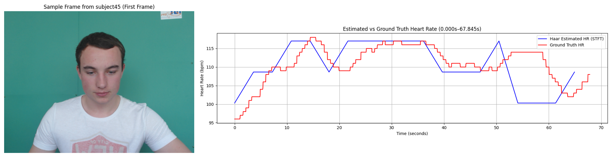
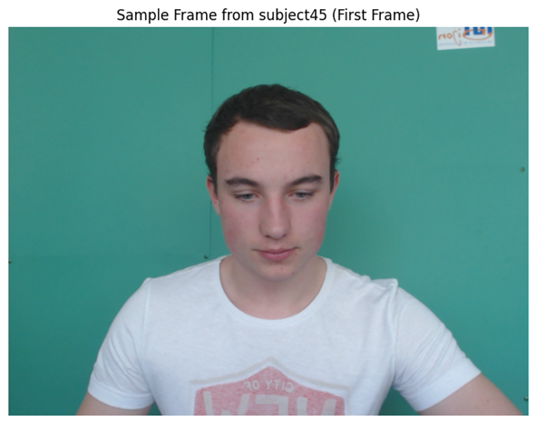
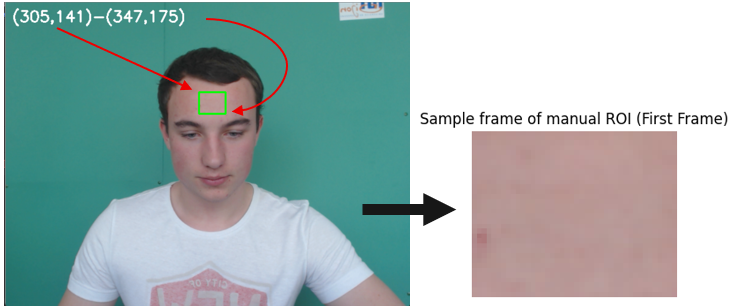
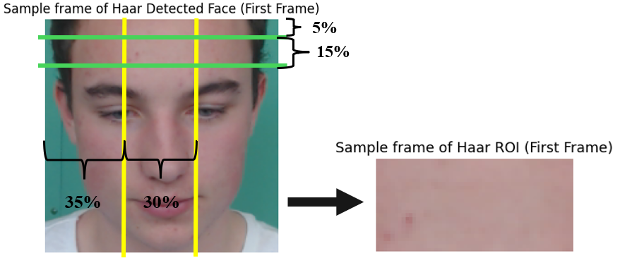
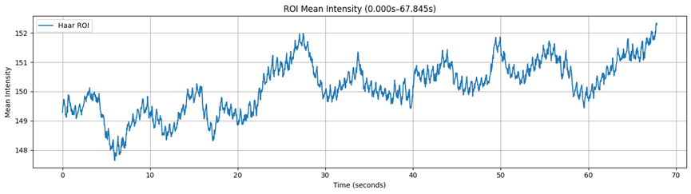
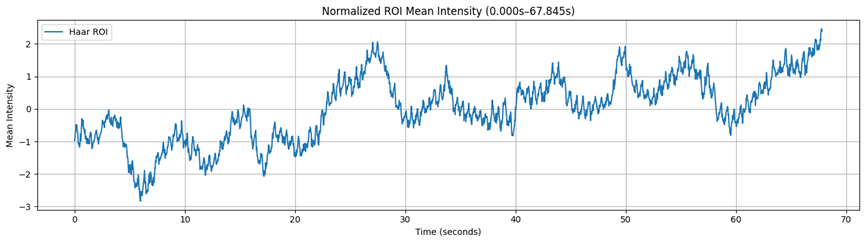
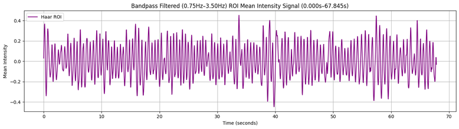
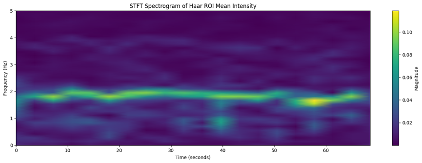
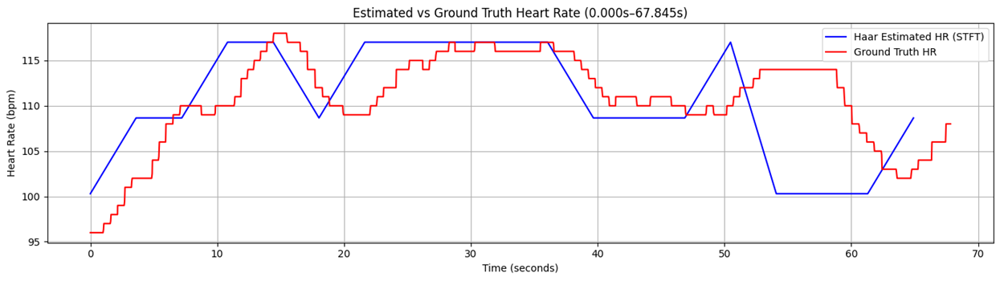

# HR Extraction from Video (Face)

  [](https://colab.research.google.com/github/iliaxant/HR_Extraction_from_Video/blob/main/HR_Extraction_from_Video.ipynb)


> An application of rPPG to extract the Heart Rate of a subject from a video of their face. 


# Table of Contents

* [Project Overview](#project-overview)
* [Project Structure](#project-structure)
* [Dependencies](#dependencies)
  * [Codes and Resources Used](#codes-and-resources-used)
  * [Python Packages Used](#codes-and-resources-used)
* [Data](#data)
  * [Source Data](#source-data)
  * [Data Acquisition](#data-acquisition)
* [Setup Instructions](#setup-instructions)
* [Code Structure](#code-structure)
* [Results and Evaluation](#results-and-evaluation)
* [Proposed Improvements](#proposed-improvements)
* [Similar Projects](#similar-projects)
* [References](#references)


# Project Overview

This implementation is a submission for the final project of the class of "Digital Image Processing" (DUTH ECE: 8th Semester 2024-2025), for which students were tasked to solve a problem of their choice using only Digital Image Processing (DIP) techniques.

The problem tackled here is the Heart Rate (HR) estimation from a facial video footage. The proposed solution is an implementation of remote Photoplethysmography, in which DIP is used to measure the subtle channel color changes of a focused area of the skin (in this case of the forehead) caused by the variable blood volume. By measuring the frequency of the normalized and denoised Blood Volume Pulse (BVP) signal the Heart Rate of the subject can be estimated in an offline way.


*Fig. 1: a) Sample frame of data (left). b) Comparison of ground truth and estimated Heart Rate.*


# Project Structure

The repository consists of the following files:
```bash
├── media
├── similar_project
│   ├── 58545_rPPG_DMS.pdf
│   └── 58545_rPPG_DMS.pptx
├── 58545_DIP_HR_Estimation.pdf
├── HR_Extraction_from_Video.ipynb
└── README.md
```
* `media`: Directory containing pictures used in README.md.
* `similar_project`: Directory containing presentation and report files *(both in greek)* of a similar project.
* `58545_DIP_HR_Estimation.pdf`: An extensive report *(in greek)* of the problem and the applied methods.
* `HR_Extraction_from_Video.ipynb`: The heart of the project. A Jupyter Notebook containing the step-by-step implementation of the solution *(text cells in greek)*. 


# Dependencies

## Codes and Resources Used
* **Editor Used:** Google Colab / Jupyter Notebook
* **Python Version:** 3.11 (Google Colab Default Runtime at the time of the project)

## Python Packages Used
All the necessary dependencies needed for the reproduction of the project are categorized as follows:

> **Note:** Since this project is developed entirely within Google Colab, the package versions listed below correspond to the default Colab environment at the time of the last code update (June 2025).

* **General Purpose & Utilities:**
  * `os` *(Built-in with Python 3.11)*: For interacting with the operating system and handling directory paths.
  * `zipfile` *(Built-in with Python 3.11)*: For extracting the dataset archives.
  * `tqdm` *(v4.66.x)*: For displaying progress bars during loop executions.
  * `google.colab` *(Native Colab library)*: For mounting Google Drive and displaying images within the Colab environment.

* **Data Manipulation & Computer Vision:** 
  * `numpy` *(v1.26.x)*: For numerical operations, matrix handling, and array manipulation.
  * `cv2` *(OpenCV v4.9.x)*: For computer vision tasks, specifically video capturing, frame extraction, color-space conversion and face/ROI detection.

* **Signal Processing:**
  * `scipy.signal` & `scipy.fft` *(v1.12.x)*: For applying Butterworth filters, Fast Fourier Transforms (FFT), Short-Time Fourier Transforms (STFT), and finding signal peaks.

* **Data Visualization:** 
  * `matplotlib.pyplot` *(v3.8.x)*: Used for all the plots within the project.


# Data

## Source Data
The dataset used in this project is the **UBFC-rPPG Dataset**[^1], which is widely used in academic research for remote photoplethysmography (rPPG).

* **Source Link:** [UBFC-rPPG Dataset](https://sites.google.com/view/ybenezeth/ubfcrppg)
* **Data Description:** The dataset consists of uncompressed video recordings of subjects filmed in 30fps and 640x480 resolution by a simple low cost webcam (Logitech C920 HD Pro) and of their corresponding ground truth obtained by a transmissive pulse oximeter (CMS50E). The dataset is divided into two sets depending on the environmental conditions.
  1. **Dataset 1 (simple):** 8 subjects that were asked to sit still but there was some movement in the (office) background. For each subject the following resources are provided:

      ```bash
      ├── gtdump.axi
      │   ├── Column 1: Timestep (ms)
      │   ├── Column 2: Heart rate (HR)
      │   ├── Column 3: SpO2
      │   └── Column 4: PPG signal
      └── vid.avi
      ```
      where `vid.avi` is the video of the subject and `gtdump.axi` the ground truth.
  
  2. **Dataset 2 (realistic):** 42 subjects that were tasked to play a time sensitive mathematical game. The subjects were not instructed to stay still and the background was static (green screen). For each subject the following resources are provided:

      ```bash
      ├── ground_truth.txt
      │   ├── Line 1: PPG signal
      │   ├── Line 2: Heart rate (HR)
      │   └── Line 3: Timestep (seconds, scientific notation)
      └── vid.avi
      ```
      where `vid.avi` is the video of the subject and `ground_truth.txt` the ground truth.
  
For the development and testing of the software, only subject 45 of Dataset 2 is used, while data of subject 11 of Dataset 1 are also used for highlighting some of the weaknesses of the proposed algorithm.

> **Note:** While only the **two above-specified subjects** are used in the final Jupyter file, the implemented algorithms are fully generalized and the code can successfully run on any subject's data within the dataset, provided they come from the same subset. More specifically, any subject of Dataset 2 can replace subject 45 and any subject of Dataset 1 can replace subject 11, but not otherwise.

## Data Acquisition
To acquire the data necessary to reproduce the project, follow the steps below:

1. **Access the Data:** Navigate to [this Google Drive folder](https://drive.google.com/drive/folders/1o0XU4gTIo46YfwaWjIgbtCncc-oF44Xk) containing the data of the UBFC-rPPG Dataset.
2. **Download the Data:** Locate the `subject45` folder in `DATASET_2` and the `11-gt` folder in `DATASET_1` and download them. You should now have 2 separate `.zip` files of those folders.
3. **Do Not Unzip:** You do not need to manually extract the files on your machine as the provided code handles the unzipping. Keep the file as `.zip`.


# Setup Instructions

1. **Load the Notebook:** Upload and open the `HR_Extraction_from_Video.ipynb` file in Google Colab.
2. **Configure the Dataset Path:** You have two options for loading the `.zip` files of the subjects into the environment:
   * **Option A (Via Google Drive):** Upload the `.zip` files to your Google Drive in a directory of your choice. This may take a few minutes. Then run the first code cell of `HR_Extraction_from_Video.ipynb` to mount your Drive. For the second code cell make sure to change the variable `zip_path` to match the exact directories of the files in your personal Drive.
   * **Option B (Local Colab Upload):** Upload the `.zip` files directly into Colab's temporary session storage using the ***Files*** section on the left sidebar. If you choose this route, running the first code cell of `HR_Extraction_from_Video.ipynb` is unnecessary, but remember to update the variable `zip_path` in the second code cell to match the exact directories of the files in the local session storage instead of in Drive.
3. **Force-install Specific Package Versions:** Because cloud environments update their software frequently, newer versions of libraries might cause compatibility issues. If you encounter any unexpected errors while running the cells, please force-install the specific package versions listed in the [Python Packages Used](#codes-and-resources-used) section. To do that create a new code cell and run, for example, the command `!pip install opencv-python==4.9.0.80`.


# Code Structure

The code of the `HR_Extraction_from_Video.ipynb` notebook can be divided into 4 parts:

* **Part 0: Setup**

  Necessary for loading the project data and importing the utilized libraries.

* **Part 1: Data Analysis**

  In this sector the `vid.avi` video file and `ground_truth.txt` ground truth file of subject 45 are analyzed in order to print useful for the user information about them. Useful information includes sample frame, total duration and frames, waveform of ground truth PPG and Heart Rate, etc.

  
  
  *Fig. 2: Sample video frame of subject 45 of UBFC-rPPG Dataset[^1].*

* **Part 2: Heart Rate Estimation**

  In this part, the algorithm for extracting the subject's Heart Rate is applied, following the below steps. It must be noted that the algorithm was developed using the methodology proposed by Berggren & Berggren (2019)[^2] as a primary reference.

  1. **ROI Definition**: The proposed algorithm does not use the whole video frame but a patch of subject 45 skin on their forehead. In this implementation two ways of defining the Region Of Interest (ROI) are tested: **a) Manual Definition**, where a stationary pixel area is predefined as the ROI for the whole video, and **b) Definition through Face Tracking**, where a patch of constant area is chosen automatically in every frame of the video using the *Viola and Jones*[^3] face detection algorithm which is based on the principle of Haar-like features.

      
      *Fig. 3: Manual ROI definition for a single frame of subject 45 video.*

      
      *Fig. 4: ROI definition through face detection for a single frame of subject 45 video.*

      > **Note:** The next steps of the algorithm are applied to both Manual and Automatic ROI. However, since the results are similar and Automatic ROI is the objectively better and smarter implementation, for the following steps only the results of this ROI are presented.

  2. **Spatial Averaging**: For the ROI of every video frame, the mean pixel intensity of a single color channel—in this case the green channel as it is more suitable for rPPG[^4]—is calculated. These sequential averages are then plotted over time to construct a raw waveform, which serves as the basis for extracting the heart rate signal.

      
      *Fig. 5: Resulting waveform of spatially averaging the green channel of the ROI of every frame.*

  3. **Normalization**: Z-score normalization is applied to the raw waveform.

      
      *Fig. 6: Normalized waveform of mean channel intensity.*
      
  4. **Bandpass Filtering**: The normalized waveform is bandpass filtered using a first order Butterworth filter of 0.75Hz-3.5Hz in order to isolate the possible cardial frequencies (45bpm-210bpm).

      
      *Fig. 7: Bandpass filtered (0.75Hz-3.5Hz 1st order Butterworth filter) waveform of mean channel intensity.*

  5. **STFT**: To extract the heart rate estimation, Short-Time Fourier Transform is applied to the filtered waveform.

      The parameters of the STFT are:

      ```python
      fs = 29.951  # Sampling frequency ~= 30Hz
      window_size = 215 
      overlap_ratio = 0.5
      ``` 

      The maximum frequency of each time window corresponds to the HR prediction.

      
      *Fig. 8: Spectogram of the STFT of the filtered waveform.*


* **Part 3: Complementary Analysis**

  In this part some extra analysis is performed to resolve 2 issues:

  1. **Deviation between estimation and ground truth**: In order to evaluate the effectiveness of the method, the differences between the estimation and target HR are examined by calculating the frequency (instantaneous HR from peak frequency for the ground truth and FFT for the estimation) in the problem timeframes.

  2. **Algorithm weaknesses**: The method is applied to the subject 11 video where there are some periodic lighting changes, in order to uncover the algorithm's inaccuracies.


# Results and Evaluation

The application of the proposed methodology to the subject 45 video leads to the predictions of *Fig. 9*.


*Fig. 9: Comparison of estimated heart rate and ground truth.*

The extra analysis of [*Part 3*](#code-structure) shows that the deviation at 53s-58s is not due to an inaccuracy of the method, but due to an issue with the ground truth. As for the time shift between estimation and ground truth, it is not a quirk, but it derives from the fact that the proposed algorithm offers offline predictions, while the oximeter gives online, and therefore, delayed readings.

However, the somewhat big size of STFT window leads to estimations that are able to follow the general changes of the heart rate, but fail to capture the small "local" fluctuations. It should also be mentioned that the values of the STFT parameters are a product of fine tuning instead of being chosen automatically. Moreover, this method fails during significant light changes and subject movements.


# Proposed Improvements

Nowadays there are many advanced rPPG methods that are way more efficient and accurate and possess way less weaknesses than the proposed method. However, should someone want to retain the proposed methodology, but improve its performance, there are some improvements that could be made:

* Replace STFT with a more effective method of frequency calculation (eg. Continuous Wavelet Transform - CWT).

* Implement a mechanism that chooses automatically the optimal parameters for frequency calculation.

* Modify the method of measuring the channel intensity so it is more robust to motional and lighting changes.


# Similar Projects

For anyone who would like to learn a little bit more about rPPG and a practical application of this tool, they can check out the [presentation](similar_project/58545_rPPG_DMS.pptx) and the corresponding [report](similar_project/58545_rPPG_DMS.pdf) (both in greek) of another project of mine, where I designed a vitals and fatigue monitoring software that utilizes rPPG in a Driver Monitoring System of a car.

This project was a submission for the final assignment of the class of "Biomedical Technology" (DUTH ECE: 9th Semester 2025-2026), for which students were tasked to design from an engineers perspective a biomedical product of their choice.


# References

[^1]: S. Bobbia, R. Macwan, Y. Benezeth, A. Mansouri, J. Dubois, "Unsupervised skin tissue segmentation for remote photoplethysmography", Pattern Recognition Letters, 2017.

[^2]: Berggrem, A., Berggrem J. (2019) Non-contact measurement of heart rate using a camera, [Master's thesis, Lund University]. lup.lub.lu.se. [http://lup.lub.lu.se/student-papers/record/8972235](http://lup.lub.lu.se/student-papers/record/8972235)

[^3]: P. Viola and M. Jones, "Rapid object detection using a boosted cascade of simple features," Proceedings of the 2001 IEEE Computer Society Conference on Computer Vision and Pattern Recognition. CVPR 2001, Kauai, HI, USA, 2001, pp. I-I, doi: 10.1109/CVPR.2001.990517.

[^4]: Verkruysse, Wim & Svaasand, Lars & Nelson, John. (2008). Remote plethysmographic imaging using ambient light.. Optics Express. 16. 21434-21445. 10.1364/OE.16.021434. 